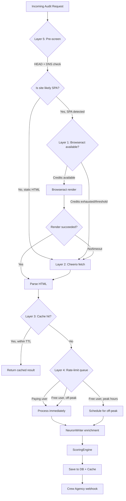

# SeoVista — Phase 2 PRD & Scalability Roadmap

> **Status:** Draft — Phase 1+ complete, E2E pipeline verified.
> **Date:** 2026-07-23
> **Scope:** Current-state audit, capacity ceiling analysis, fallback architecture, and Phase 2+ feature roadmap.

---

## TL;DR

0. **What SeoVista is**: a global, English-first GEO & Search Visibility platform that helps brands "be found, be understood, be cited" across traditional search and AI-generated answers. A free GEO Readiness Checker produces a 0–100 score with per-platform readiness (ChatGPT, Perplexity, Google AI Overviews, Bing Copilot), turning audits into qualified leads for GMedya Group's Crew Agency. See **Section 0 — Product Foundations** for the full product context.
1. **Phase 1+ is fully operational**: the E2E pipeline (URL → SSRF validate → Browseract/Cheerio render → 7-module ScoringEngine → NeuronWriter enrichment → PostgreSQL persist → Crew Agency webhook) is verified and self-hosted with zero external scoring dependencies.
2. **Browseract is the hard ceiling**: at ~20 credits/SPA render and 130k credits/month, capacity is ~6,500 SPA renders/month — the single most constraining resource. NeuronWriter (40k credits, ~1.5 credits/query) supports ~26k audits/month and is not the bottleneck.
3. **Worker concurrency = 1** (BullMQ default, not overridden): at ~60–120s per audit, the single-worker throughput ceiling is ~700–1,400 audits/month before any credit limit is reached. This is the first scaling wall.
4. **A 5-layer fallback strategy** (cache → pre-screen → Cheerio-only → off-peak queue → self-hosted Playwright) can extend the paid-API capacity by 3–5× without re-architecting, using incremental additions to `fetcher.ts` and a new Redis cache layer.
5. **Phase 2 priority features**: Redis result cache (highest ROI, lowest effort), intelligent scrape router, BullMQ concurrency tuning, then SERP preview, continuous monitoring, and bulk audit.

---

## 0. Product Foundations

> This section establishes what SeoVista is, the problem it solves, who it serves, and the boundaries of its current behavior. All positioning language quoted here is taken verbatim from the authoritative PRD (`SeoVista — Global GEO & Search Visibility Website.md`).

### 0.1 What is SeoVista?

SeoVista is a global, English-first **GEO & Search Visibility** platform. Its product thesis, quoted from the authoritative PRD, is that it "helps ambitious brands become **found, understood and cited** across traditional search and AI-generated answers." Its core promise is: **"Be found. Be understood. Be cited."** Its hero headline is **"Become the answer your market trusts."** The primary conversion is **`Get a GEO Audit`**; the secondary conversion is **`Check your AI readiness`** via the flagship free tool.

**Why now — the GEO / AEO / SEO context.** The homepage utility strip states it plainly: **"SEO is evolving into answer visibility."** Google AI Overviews, ChatGPT, Gemini, Perplexity, and Bing Copilot increasingly synthesize answers from crawled content rather than presenting ten blue links. Traditional SEO optimized for crawlers, indexability, and ranking positions; it did not optimize for *being cited inside a synthesized answer*. This new discipline — making content discoverable, understandable, and citation-ready for large language models — is **Generative Engine Optimization (GEO)**, also called **Answer Engine Optimization (AEO)**. SeoVista occupies the intersection of GEO strategy, technical SEO, content intelligence, digital authority, and measurement — connecting "Owned Content + Technical Entity Signals + Earned Media Authority in one operating model." The PRD is explicit that GEO "complements — not replaces — technical SEO, content quality and reputation."

### 0.2 The Problem

Three converging problems create the market gap:

1. **Traditional SEO does not cover AI/LLM search visibility.** Conventional audit tools measure crawlability, backlinks, keyword rankings, and on-page factors. None tell a marketer whether ChatGPT, Perplexity, or Google AI Overviews can actually *read, understand, and cite* their content. A site can rank #1 on Google and be invisible to every generative engine.
2. **Marketers have no self-serve tool to see how AI search engines "read" their site.** No widely accessible instrument scores a URL across the dimensions that matter for AI citation — entity clarity, structured-data completeness, answer-ready content structure, semantic coverage, and citation readiness. Marketers are flying blind on an entire channel that now mediates a growing share of discovery.
3. **Manual audits don't scale; agencies charge high fees.** A human GEO consultant produces a credible audit at a cost of thousands of dollars and weeks of turnaround — not repeatable across a portfolio of client sites, and not offerable as a low-friction lead magnet. SeoVista automates the audit into a 60–120 second pipeline that produces a reproducible, versioned score, democratizing a capability previously available only through expensive bespoke engagements.

### 0.3 Target Audience

SeoVista serves three audience tiers, each with distinct needs:

| Tier | Audience | Need | Conversion Path |
|---|---|---|---|
| **Primary** | B2B marketing agencies | Lead-gen tool to share with prospects; upsell into paid GEO services | Free tool → captured lead → Crew Agency proposal → engagement |
| **Secondary** | In-house enterprise marketing teams | Visibility score benchmark + prioritized issues for their properties | Free audit → detailed report (email gate) → consultation |
| **Tertiary** | Bootstrapped founders / indie hackers | Quick AI-readiness check, no signup friction | Free tool → instant summary → optional email for full report |

**Geography.** SeoVista is a **global** product. Default language is English at `/`; Turkish may launch later under `/tr/` and must not delay the English launch. The company's origin is Turkish — branded as **"A GMedya Group company"** in the footer and About page — but the positioning is explicitly "global, premium search visibility company, not as a Turkish backlink marketplace." GMedya appears as a parent-organization relationship, not the primary brand.

### 0.4 Value Proposition

The value proposition differs by audience tier:

- **For agencies:** The free GEO Readiness Checker is a **lead generation engine**. Agencies point prospects to the tool, capture qualified contact information, and receive an autonomous webhook to Crew Agency that triggers proposal generation when a site scores below 60 — the "Agentic B2B SEO Machine" thesis.
- **For enterprise teams:** SeoVista delivers a **visibility score** (0–100) with per-platform readiness across ChatGPT, Perplexity, Google AI Overviews, and Bing Copilot, plus prioritized issues and quick wins — a benchmark to track over time with a concrete remediation roadmap.
- **For indie founders:** A **60-second AI readiness assessment** with no signup required for the summary. The user enters a URL, gets an instant score and top issues, and only encounters an email gate for the detailed report — respecting the PRD mandate to "provide immediate value first and ask for contact information at a natural point."

### 0.5 What SeoVista ACTUALLY Does Today

The Phase 1+ platform is fully operational. These behaviors are verified and live:

1. **Public URL form → audit checkout flow.** A visitor enters a public URL at `/tools/geo-readiness-checker/`. The server action validates input via Zod, blocks internal domains, creates lead + job records in PostgreSQL, and enqueues a BullMQ job. The user is redirected to a result page that polls for completion.
2. **7-module scoring engine with per-platform readiness.** The self-hosted `ScoringEngine` runs seven weighted modules — Indexability (20), Technical (20), Content (20), Semantic (15), Experience (10), Linking (10), AI Visibility (5) — producing a 0–100 score with cap rules. The AI Visibility module emits **per-platform readiness** for ChatGPT, Perplexity, Google AI Overviews, and Bing Copilot, plus issues, quick wins, and recommendations.
3. **Gated detailed report (email + marketing consent).** After the instant summary, the user unlocks the detailed report by submitting a work email and explicit, separate marketing consent (never pre-checked) — implementing the PRD's "immediate value before gating" principle.
4. **Internal CMS for insights/blog.** NextG CMS (mock on port 3101, typed contracts in `packages/content-models`) powers editorial content at `/insights/[slug]`.
5. **Admin panel (CRM + CMS management).** Protected admin routes (`/admin/(protected)/`) provide a leads dashboard, CMS management, and overview dashboard with session-based auth and RBAC.
6. **Autonomous webhook to Crew Agency.** After every completed audit, the worker POSTs to `crew.tr4.net/api/teklif-yaz` with brand, score, issues, and a `proposalTrigger` flag (`true` when score < 60 or band is critical/poor) — autonomously generating sales proposals. Webhook failures are fire-and-forget.

### 0.6 What SeoVista Does NOT Do (Boundaries)

Defining what SeoVista is *not* is as important as defining what it is. The PRD prohibits unsupported claims, and the current architecture has clear scope limits:

- **Not a SERP rank tracker.** SeoVista does not track keyword positions in Google. A SERP preview feature (snippet rendering) is planned for Phase 2 but does not track rankings.
- **Not a backlink analysis tool.** SeoVista does not analyze backlink profiles or domain authority. The AI Visibility module's third-party mention data is explicitly a placeholder (`THIRD_PARTY_MENTION_DATA_UNAVAILABLE`).
- **Not a content generator.** SeoVista scores and diagnoses content; it recommends improvements but does not produce content.
- **Not a real-time crawler (Phase 2).** Audits are on-demand, triggered by form submission. No continuous monitoring or scheduled re-crawl exists yet.
- **Not a guaranteed-citation or guaranteed-ranking tool.** The PRD prohibits claiming "guaranteed AI citations or Google rankings" and prohibits representing `llms.txt` as a ranking factor. SeoVista measures readiness; it does not promise outcomes.

### 0.7 Business Model

The PRD defines the launch business model with deliberate restraint: **"Expert-led services + assessments. Do not present SeoVista as a mature SaaS platform until the tools and recurring product genuinely exist."**

- **Free tool = lead generation.** The GEO Readiness Checker provides genuine value (a real audit with a real score) at zero cost, capturing qualified leads who self-select by submitting their URL and work email.
- **Paid upsells delegated to Crew Agency.** When an audit scores below 60, the autonomous webhook triggers Crew Agency to generate a proposal. Monetization happens through Crew Agency's sales process, not a SeoVista checkout. SeoVista is the lead engine; Crew Agency is the revenue engine.
- **White-label / multi-tenant future.** The architecture includes a `tenant_id` field in `ScoreContext` (currently hardcoded to `"worker-tenant"`). Per-tenant auth, API keys, credit budgets, and branded report pages are a Phase 4 capability (Section 11, P4).

### 0.8 Source-of-Truth Hierarchy

When documents conflict, the resolution order is fixed:

1. **SeoVista PRD** (`SeoVista — Global GEO & Search Visibility Website.md`) — authoritative for product behavior, brand, content, public routes, and acceptance criteria. **The PRD wins.**
2. **SeoVista Implementation Brief** (`SeoVista — AI Developer Implementation Brief v1.md`) — authoritative for engineering sequence, architecture, constraints, and non-functional requirements.
3. **`AGENTS.md`** — engineering rules, mission boundaries, and tooling. Not an independent product authority; must conform to the PRD and Brief.
4. **Generated code, fixtures, and third-party dependencies** (including OpenSEO) — must conform to all of the above.

This hierarchy is quoted from AGENTS.md and the Implementation Brief Section 0: "If code, mockups or generated copy conflict with the PRD, the PRD wins."

### 0.9 Glossary

| Term | Definition |
|---|---|
| **GEO** | Generative Engine Optimization — optimizing content to be discovered, understood, and cited by AI-powered generative search engines (ChatGPT, Perplexity, Google AI Overviews, Gemini). Distinct from traditional SEO, which targets ranked link placement. |
| **AEO** | Answer Engine Optimization — a synonym-adjacent term for GEO, emphasizing optimization for engines that synthesize answers rather than rank pages. |
| **SEO** | Search Engine Optimization — the established discipline of optimizing web content for crawler-based search engines (Google, Bing) to achieve higher organic rankings. SeoVista treats GEO as complementary to, not a replacement for, SEO. |
| **LLM citation** | An instance where a large language model references or attributes information to a specific source domain in its generated response. The core outcome GEO aims to increase. |
| **AI Overview** | Google's generative answer feature that synthesizes an AI-generated summary at the top of search results, citing sources inline. One of the four platforms SeoVista scores for readiness. |
| **SPA** | Single Page Application — a web app that loads a bare HTML shell and renders content client-side via JavaScript (React, Vue, Angular, Next.js CSR). SPAs require headless browser rendering (Browseract) for accurate crawling. |
| **JSON-LD** | JavaScript Object Notation for Linked Data — a serialization format for schema.org structured data embedded in `<script type="application/ld+json">` tags. SeoVista's `packages/schema` generates server-rendered JSON-LD graphs; the Technical scoring module checks for its presence and validity. |
| **SSRF** | Server-Side Request Forgery — a vulnerability where an attacker tricks a server into making requests to internal network resources. SeoVista's `validateSSRF()` blocks private, loopback, link-local, and cloud metadata IP ranges before any outbound connection. |
| **BullMQ** | A Redis-backed distributed job queue library for Node.js. SeoVista uses BullMQ to process `geo_readiness_jobs` asynchronously in a dedicated worker (`apps/worker`). Current worker concurrency = 1, the primary throughput bottleneck (see Section 3). |

---

## 1. Executive Summary

SeoVista has completed its Phase 1+ transformation into an "Agentic B2B SEO Machine." The platform now runs a fully self-hosted scoring engine (`packages/geo-engine`) with seven modules — Indexability, Technical, Content, Semantic, Experience, Linking, and AI Visibility — producing a 0–100 GEO readiness score, per-platform readiness (ChatGPT, Perplexity, Google AI Overviews, Bing Copilot), issues, quick wins, and recommendations. HTML crawling is real with SSRF protection; SPA rendering delegates to Browseract.com with Cheerio fallback; NeuronWriter provides NLP semantic enrichment (LSI terms, entities, competitor analysis); and Crew Agency receives an autonomous sales webhook when scores fall below 60.

The E2E pipeline is verified: URL → render → parse → score → enrich → DB → webhook. The architecture is a pnpm monorepo with Next.js App Router (web on port 3200), a BullMQ worker, PostgreSQL (55432), and Redis (56379).

**What's at stake**: the platform works at low volume but has no caching, no concurrency tuning, no credit-budget awareness, and no graceful degradation when provider quotas exhaust. The current single-worker, single-concurrency design will hit a throughput wall at ~1,000 audits/month — well before the Browseract credit limit. Without a fallback layer, a traffic spike to 2,000+ audits/month would cause Browseract credit exhaustion, unbounded NeuronWriter polling, and webhook flooding to Crew Agency. The platform needs a credit-aware routing layer, a Redis result cache, and concurrency scaling before it can serve production traffic reliably.

---

## 2. Current Capabilities

| Capability | What It Does | Worker / File | Limits & Constraints |
|---|---|---|---|
| **URL Fetch & SSRF Validation** | Validates URL against private/loopback/metadata IP ranges via `dns.lookup` + `ipaddr.js` before any connection. | `apps/worker/src/utils/fetcher.ts` — `validateSSRF()` | Blocks 8 IP ranges (private, loopback, linkLocal, etc.). DNS failure = rejection. |
| **Static HTML Crawling** | Fetches HTML via native `fetch()`, parses with Cheerio into `ParsedPage` (title, meta, headings, links, images, JSON-LD, OG, Twitter, textContent). | `fetcher.ts` — `fetchViaCheerio()`, `parseHtmlToParsedPage()` | No concurrency limit on fetch itself; bounded by worker concurrency. User-Agent: `SeoVista Crawler/1.0`. |
| **SPA Rendering (Browseract)** | Headless rendering via Browseract workflow API: POST `run-task` → poll `get-task-status` (5s interval, 120s max) → GET `get-task` for rendered HTML. Extracts HTML from JSON-wrapped `output.string`. | `fetcher.ts` — `fetchViaBrowseract()`, `extractHtmlFromBrowseractOutput()` | Requires `BROWSERACT_API_KEY` + `BROWSERACT_WORKFLOW_ID`. 130k credits/month (stated). ~10–30 credits/render. 120s polling timeout. |
| **JS-Bundle Detection** | Heuristic: checks for `#root`/`#app`/`#__next` shells with <150 chars textContent, or <50 chars with script tags. Triggers Browseract retry if Cheerio output looks like a CSR shell. | `fetcher.ts` — `isJsBundleRendering()` | Heuristic only; may miss or false-positive on edge cases. |
| **Self-Hosted Scoring Engine** | 7 modules producing weighted 0–100 score with cap rules. Modules: Indexability (20pts), Technical (20pts), Content (20pts), Semantic (15pts), Experience (10pts), Linking (10pts), AI Visibility (5pts). | `packages/geo-engine/src/engine.ts` — `ScoringEngine.scorePage()` | Cap rules clamp score to 25–80 based on critical issues (5xx, noindex, canonical mismatch, thin content, missing title). Failed modules fall back to maxScore gracefully. |
| **NeuronWriter NLP Enrichment** | Creates query via `POST /new-query`, polls `POST /get-query` (5s interval, 120s max) until `status === "ready"`. Returns LSI terms, entities, recommended headings, competitor content scores, people-also-ask questions. | `packages/geo-engine/src/providers/neuronwriter.ts` — `enrichWithNeuronWriter()` | Requires `NEURONWRITER_API_KEY` + `NEURONWRITER_PROJECT_ID`. 40k credits/month (stated). ~1–2 credits/query. 120s polling timeout. 30s axios timeout. Falls back to error status (non-fatal) if unconfigured. |
| **Semantic Gap Analysis** | Compares page content against NeuronWriter LSI terms and entities. Emits `SEMANTIC_LSI_GAP` and `SEMANTIC_ENTITY_GAP` issues. Also checks keyword presence in title, H1, intro, body. | `packages/geo-engine/src/modules/semantic.ts` — `SemanticModule` | 15pts max. Penalty: -2 to -5 per gap. If no `targetKeyword`, infers topic from title/H1/intro with reduced confidence. |
| **AI Visibility Readiness** | Scores answerability (FAQ/question headings), citation readiness (outbound authority links), AI parseability (lists/tables), entity clarity (word count heuristic). Produces per-platform readiness scores. | `packages/geo-engine/src/modules/ai-visibility.ts` — `AiVisibilityModule` | 5pts max. Platform scores are experimental (0.6–0.8 confidence). Third-party mention data unavailable (placeholder). |
| **Database Persistence** | Saves `job_results` (JSONB payload with scores, issues, dimensions) and updates `job_records` status. Links to `geo_audit_leads` via `lead_id`. | `apps/worker/src/queue/geo-worker.ts` + `apps/worker/src/db/geo-audit-repository.ts` | PostgreSQL 16 on port 55432. DB client `max: 2` connections. No retry on DB failure. |
| **Crew Agency Webhook** | POST to `crew.tr4.net/api/teklif-yaz` with brand, score, issues, and `proposalTrigger` flag (true when score < 60 or band critical/poor). Async: returns `job_id` for tracking. Fire-and-forget — webhook failures do not fail the geo job. | `geo-worker.ts` — `notifyCrewAgency()` | Requires `CREW_AGENCY_API_KEY`. Token-based, rate-limited (no formal SLA). No retry/queue on webhook failure. |
| **Public Geo Checker Form** | Server action validates URL (Zod schema, blocks internal domains), creates lead + job record, redirects to result page. | `apps/web/src/lib/geo-checker/actions.ts` — `startGeoAuditAction()` | No rate limiting on form submission. No CAPTCHA. No per-IP throttle (env var `AUDIT_PER_IP_RATE_LIMIT` defined but not enforced). |
| **Gated Report Unlock** | Email gate: user submits email + consent to unlock detailed report. Updates `geo_audit_leads.work_email`. | `actions.ts` — `unlockDetailedReport()` | Single form, no email verification. |
| **Admin Panel** | Protected admin routes for leads dashboard, CMS management, overview. Session-based auth with RBAC. | `apps/web/app/admin/(protected)/` + `apps/web/src/lib/admin/` | Single-tenant auth. No multi-tenant isolation. |
| **BullMQ Job Queue** | Worker processes `geo_readiness_jobs` queue. Ping queue for health checks. Graceful shutdown on SIGTERM/SIGINT. | `apps/worker/src/worker.ts` + `apps/worker/src/queue/geo-worker.ts` | **Concurrency: 1** (BullMQ default, not overridden). Redis on port 56379, `maxmemory 128mb`, `noeviction` policy. |

---

## 3. Resource Limits & Cost Ceiling (CRITICAL)

### 3.1 Browseract — 130,000 credits/month (stated)

| Metric | Value | Basis |
|---|---|---|
| Credits/month | 130,000 | User-stated (Browseract dashboard) |
| Credits per SPA render | 10–30 (avg ~20) | Estimated based on Browseract workflow pricing model; **to be verified** against actual billing |
| Max SPA renders/month | **~6,500** (at avg 20 credits) | 130,000 ÷ 20 |
| Best case (10 credits/render) | ~13,000 renders | 130,000 ÷ 10 |
| Worst case (30 credits/render) | ~4,333 renders | 130,000 ÷ 30 |
| Polling latency per render | 10–120s | 5s poll interval, 120s max timeout |
| Concurrent renders | 1 (worker concurrency) | BullMQ default, not overridden in `geo-worker.ts` |

### 3.2 NeuronWriter — 40,000 credits/month (stated)

| Metric | Value | Basis |
|---|---|---|
| Credits/month | 40,000 | User-stated |
| Credits per query | ~1–2 (avg ~1.5) | Estimated; NeuronWriter charges per query creation; **to be verified** |
| Max queries/month | **~26,666** (at avg 1.5 credits) | 40,000 ÷ 1.5 |
| Polling latency per query | 5–120s | 5s poll interval, 120s max timeout |
| Concurrency | 1 (worker concurrency) | Same single-worker bottleneck |

### 3.3 Crew Agency — Token-based, rate-limited

| Metric | Value | Basis |
|---|---|---|
| Hard limit | None stated | Token-based authentication |
| Rate limit | Implied but unspecified | No formal SLA documented |
| Webhook trigger rate | Fires on every completed audit with score < 60 | `proposalTrigger: overallScore < 60 \|\| band === 'critical' \|\| band === 'poor'` |
| Expected trigger volume | ~60% of audits (estimated) | If most submitted sites have poor GEO readiness |

### 3.4 Per-Audit Time Budget

| Phase | Static (Cheerio) Site | SPA (Browseract) Site |
|---|---|---|
| SSRF validation + DNS | ~0.1–0.5s | ~0.1–0.5s |
| HTML fetch/render | 1–5s | 10–120s (Browseract polling) |
| HTML parsing (Cheerio) | ~0.1s | ~0.1s |
| NeuronWriter query + poll | 5–120s | 5–120s |
| 7 scoring modules | ~0.5–1s | ~0.5–1s |
| DB write | ~0.05s | ~0.05s |
| Crew Agency webhook | ~0.2s (fire-and-forget) | ~0.2s (fire-and-forget) |
| **Total per audit** | **~7–127s** | **~16–242s** |
| **Average estimate** | **~30–45s** | **~60–90s** |

### 3.5 Capacity at Current Architecture

**Worker concurrency = 1** (BullMQ default, no override in `startGeoWorker()`).

| Scenario | Audits/month (throughput-limited) | Audits/month (credit-limited) | Effective ceiling |
|---|---|---|---|
| All static sites (Cheerio only) | ~1,400–2,000 (at 30–45s/audit, 1 worker) | Unlimited (no Browseract) | **~1,400–2,000** |
| All SPA sites (Browseract) | ~700–1,000 (at 60–90s/audit, 1 worker) | ~6,500 (130k credits) | **~700–1,000** |
| Mixed (50% static, 50% SPA) | ~900–1,300 | ~6,500 SPA + unlimited static | **~900–1,300** |

> **Conclusion**: The worker concurrency (1) is the first bottleneck, hit at ~1,000–2,000 audits/month — well before the Browseract credit limit of ~6,500 SPA renders. Credit exhaustion is the second bottleneck, hit at ~6,500 SPA audits. NeuronWriter credits (~26k) are not the bottleneck unless >50% of audits are SPA and worker concurrency is raised significantly.

### 3.6 Daily Traffic Thresholds

| Daily audits | Monthly equivalent | Bottleneck | Status |
|---|---|---|---|
| 30/day | ~900/month | Worker concurrency | **OK** — within single-worker capacity |
| 65/day | ~2,000/month | Worker concurrency + Browseract | **At risk** — worker saturated, SPA queue grows |
| 165/day | ~5,000/month | Browseract credits | **Broken** — credits exhaust by day ~20 |
| 330/day | ~10,000/month | Both + Crew Agency | **Critical** — multiple systems failing |

---

## 4. Scalability Risks

### Scenario A: 500 audits/month (~17/day)

| Component | Status | Impact |
|---|---|---|
| Worker (concurrency=1) | **Healthy** | ~17 audits/day at ~60s avg = ~17min total processing time. Well within capacity. |
| Browseract credits | **Healthy** | ~250 SPA renders (50% of 500) × 20 credits = 5,000 credits. 3.8% of monthly budget. |
| NeuronWriter credits | **Healthy** | 500 queries × 1.5 credits = 750 credits. 1.9% of monthly budget. |
| PostgreSQL | **Healthy** | 500 rows/month in `job_results`. Negligible. |
| Redis | **Healthy** | Queue depth stays low. 128mb more than sufficient. |
| Crew Agency | **Healthy** | ~300 webhooks/month (60% trigger rate). No rate limit concern. |
| **UX impact** | None — audits complete within 30–90s. | |

### Scenario B: 2,000 audits/month (~67/day)

| Component | Status | Impact |
|---|---|---|
| Worker (concurrency=1) | **Saturated** | 67 audits/day × ~60s = ~67min processing. Queue backlog grows during peak hours. Users may wait 5–15min for result. |
| Browseract credits | **Approaching limit** | ~1,000 SPA renders × 20 credits = 20,000 credits. 15.4% of budget. OK for now but unsustainable if traffic grows. |
| NeuronWriter credits | **Healthy** | 2,000 × 1.5 = 3,000 credits. 7.5% of budget. |
| PostgreSQL | **Healthy** | 2,000 rows/month. Still negligible. |
| Redis | **Stressed** | Queue depth may reach 50+ during peaks. `noeviction` policy means BullMQ metadata could hit 128mb limit if backlog grows large. |
| Crew Agency | **Moderate** | ~1,200 webhooks/month. May trigger rate limits if bursty. |
| **UX impact** | Queue wait times of 5–15min during peak. Result page polling may timeout. | |

### Scenario C: 5,000 audits/month (~167/day)

| Component | Status | Impact |
|---|---|---|
| Worker (concurrency=1) | **Broken** | 167 audits/day × ~60s = ~167min (2.8 hours) of processing. At peak, queue backlog could be 50+ jobs. Wait times: 30–60min. |
| Browseract credits | **Exhausted by day ~20** | ~2,500 SPA renders × 20 credits = 50,000 credits. 38.5% of budget. But with concurrency=1, only ~700–1,000 SPA renders possible anyway. Credits last the month but queue is the wall. |
| NeuronWriter credits | **Approaching** | 5,000 × 1.5 = 7,500 credits. 18.75% of budget. OK. |
| PostgreSQL | **Moderate** | 5,000 rows/month. `job_results.payload` JSONB ~2–5KB each = ~25MB. Fine. |
| Redis | **At risk** | If concurrency raised to handle volume, queue depth + BullMQ event stream could exceed 128mb. |
| Crew Agency | **Stressed** | ~3,000 webhooks/month. Likely hitting rate limits. No retry logic. |
| **UX impact** | Multi-hour wait times. Audits may timeout. Browseract 120s polling timeout causes fallback to Cheerio for SPA sites (degraded results). | |

### Scenario D: 10,000+ audits/month (~333+/day)

| Component | Status | Impact |
|---|---|---|
| Worker (concurrency=1) | **Completely broken** | 333 audits × 60s = 5.5 hours of processing/day. Queue grows unbounded. Most jobs never complete. |
| Browseract credits | **Exhausted by day ~10** | ~5,000 SPA renders × 20 credits = 100,000 credits. 77% of budget. Exhausted before month-end. |
| NeuronWriter credits | **Exhausted by day ~20** | 10,000 × 1.5 = 15,000 credits. 37.5% of budget. Approaching but not exhausted. |
| PostgreSQL | **Needs tuning** | 10,000 rows/month × ~3KB = ~30MB. Still fine but `job_records` scans for status polling become slow without indexes. |
| Redis | **Critical** | Queue overflow. `noeviction` means writes fail when 128mb is full. BullMQ jobs may be lost. |
| Crew Agency | **Flooded** | ~6,000 webhooks/month. Almost certainly rate-limited or blocked. No throttle/queue. |
| **UX impact** | Platform unusable. Most audits never complete. Credit exhaustion causes cascading fallback to Cheerio-only (no SPA rendering, no NLP). Crew Agency webhook failures. | |

---

## 5. Proposed Fallback Architecture



### Layer 1: Primary Path — Browseract + NeuronWriter (Current)

**When active**: Default for all audits when credits are above threshold.

**Current behavior**: Always attempts Browseract if `BROWSERACT_API_KEY` + `BROWSERACT_WORKFLOW_ID` are set. Always calls NeuronWriter if `NEURONWRITER_API_KEY` is set.

**Change needed**: Add credit budget tracking (see Layer 4).

### Layer 2: Cheerio + Local NLP — Credit Exhaustion Fallback

**When active**: Browseract credits below threshold (e.g., <10% remaining) OR Browseract timeout/failure.

**What happens**: 
- Fetch via `fetchViaCheerio()` only (already implemented as fallback in `fetcher.ts`).
- Skip NeuronWriter enrichment (set `includeNeuronWriter: false` in `ScoreContext.options`).
- `SemanticModule` falls back to its Branch 2 logic (topic inference from title/H1/intro without LSI terms).
- `AiVisibilityModule` continues working (it doesn't depend on NeuronWriter).

**Impact on score quality**:
- Semantic module loses LSI/entity gap detection (loses ~2–4 points from 15).
- No competitor benchmarking or recommended headings.
- Overall score is still valid but less actionable.

**Implementation**: Already partially implemented. The fetcher falls back to Cheerio on Browseract failure. The worker would need to check a credit-budget flag before setting `includeNeuronWriter: true`.

### Layer 3: Cache Memoization — Same URL Within TTL

**When active**: Any audit request where the URL (canonicalized) has been audited within the cache TTL.

**What happens**: Return cached `ScoreOutput` directly from Redis without invoking fetcher, Browseract, or NeuronWriter. Costs zero credits.

**TTL**: 7 days default, configurable via `CACHE_TTL_DAYS` env var. Extends to 30 days for paying users.

**Invalidation triggers**:
- User explicitly requests "force re-audit" (bypasses cache).
- Scoring engine methodology version change (bump `scoreVersion` → all cache entries with old version are stale).
- Admin invalidation per-URL or per-domain.

**Implementation**: See Section 7 (Caching Layer) for detailed design.

### Layer 4: Rate-Limit Queueing — Off-Peak Scheduling

**When active**: Queue depth > N jobs OR credit burn rate > X credits/hour.

**What happens**:
- **Paying users**: Jobs are prioritized (BullMQ job priority field). Processed immediately.
- **Free users during peak**: Jobs are delayed to off-peak hours (22:00–06:00 UTC). BullMQ supports delayed jobs natively via `job.delay(timestamp)`.
- **Credit budget guard**: A Redis counter tracks credits consumed today/month. When daily budget is exceeded, free-user jobs are delayed to the next day.

**User tiers** (proposed):
| Tier | Priority | Cache TTL | Max concurrency | NeuronWriter |
|---|---|---|---|---|
| Free | 5 (lowest) | 7 days | Shared pool | Best-effort |
| Pro | 3 | 14 days | Dedicated slot | Always |
| Enterprise | 1 (highest) | 30 days | Dedicated slot | Always + cache bypass on demand |

**Implementation**: BullMQ `Worker` options support `concurrency`. Job priority set at enqueue time via `Queue.add(name, data, { priority })`.

### Layer 5: Lightweight Pre-Screen — Cheap HEAD Check

**When active**: Before every fetch, as a gate to decide which scraper to use.

**What happens**:
1. **HEAD request** to the target URL (or GET with `Range: bytes=0-2048` if HEAD unsupported).
2. Check response headers:
   - `Content-Type`: if `text/html` with substantial `Content-Length`, likely static → use Cheerio.
   - If `Content-Length` is tiny (<2KB) and no `X-Rendered-By` header, likely SPA shell → use Browseract.
3. **DNS check**: already performed by SSRF validation. Reuse the resolved IP.
4. If HEAD fails (405 Method Not Allowed), fall through to Cheerio GET and use `isJsBundleRendering()` heuristic.

**Cost**: ~1 HTTP request (no Browseract credits, no NeuronWriter credits).

**Benefit**: Skips Browseract entirely for static sites, saving 10–30 credits per static-site audit. If 50% of sites are static, this doubles effective Browseract capacity.

**Implementation**: Add a `prescreenUrl()` function in `fetcher.ts` called before the Browseract/Cheerio decision tree.

---

## 6. Intelligent Routing / Scrape Strategy Layer

A "smart router" inside `fetcher.ts` that decides per-URL which scraper to use, based on multiple signals.

### Decision Matrix

| Signal | Detection Method | Routing Decision |
|---|---|---|
| **URL pattern** | Path regex: `/api/*`, `*.json`, `*.xml`, `/feed` | Skip Browseract entirely → Cheerio or direct parse |
| **Domain fingerprint** | Maintain a Redis set of known-SPA domains (React, Vue, Angular, Next.js detected via previous audits) | Known SPA → Browseract preferred |
| **Content size heuristic** | HEAD request `Content-Length` | <2KB HTML → likely SPA shell → Browseract. >50KB → Cheerio sufficient |
| **HTML complexity** | Quick Cheerio parse of first 5KB: count `<script[src]>` tags | >5 script tags + <150 chars text → SPA → Browseract |
| **Latency budget** | Per-request deadline (configurable, default 90s) | If Browseract polling exceeds 60s, abort → Cheerio fallback |
| **Credit budget** | Redis counter: `browseract:credits:consumed:today` | If daily budget exceeded → Cheerio only |
| **Cache hit** | Redis lookup before any fetch | Hit → return cached result, zero credits |

### Proposed Implementation in `fetcher.ts`

```typescript
// New config knobs (env vars)
const ROUTER_CONFIG = {
  browseractCreditDailyLimit: Number(process.env.BROWSERACT_DAILY_CREDIT_LIMIT ?? 4000),
  browseractCreditMonthlyLimit: Number(process.env.BROWSERACT_MONTHLY_CREDIT_LIMIT ?? 130000),
  latencyBudgetMs: Number(process.env.LATENCY_BUDGET_MS ?? 90000),
  spaDetectionThreshold: Number(process.env.SPA_DETECTION_THRESHOLD ?? 150), // min textContent chars
  prescreenEnabled: process.env.PRESCREEN_ENABLED !== 'false',
  cacheEnabled: process.env.CACHE_ENABLED !== 'false',
  cacheTtlDays: Number(process.env.CACHE_TTL_DAYS ?? 7),
};
```

### Routing Flow (pseudocode for `fetchAndParseUrl` v2)

```
1. validateSSRF(url)
2. cacheKey = sha256(canonicalize(url))
3. IF cacheEnabled AND redis.exists(cacheKey):
     RETURN redis.getJson(cacheKey)  // Layer 3: cache hit
4. IF prescreenEnabled:
     prescreen = await prescreenUrl(url)  // Layer 5: HEAD check
     IF prescreen.isStatic:
       route = 'cheerio'
     ELSE IF prescreen.isSpa:
       route = 'browseract'
     ELSE:
       route = 'auto'  // fall through to current logic
5. IF route == 'browseract' AND creditsRemainingToday < minCreditsPerRender:
     route = 'cheerio'  // Layer 2: credit exhaustion fallback
6. IF route == 'auto' OR route == 'browseract':
     TRY browseract fetch with latencyBudgetMs deadline
     ON failure/timeout → cheerio fallback
7. parse HTML → ParsedPage
8. return ParsedPage (caller decides on NeuronWriter + caching)
```

### Cost Optimization Scoring

For future enhancement: score each route by `(estimated_cost × accuracy_weight)` and pick the minimum.

| Route | Cost (credits) | Accuracy | Score (cost × 1/accuracy) |
|---|---|---|---|
| Cache hit | 0 | 0.95 (may be stale) | 0.00 |
| Cheerio only | 0 | 0.70 (misses SPA content) | 0.00 |
| Cheerio + NeuronWriter | 1.5 | 0.85 | 1.76 |
| Browseract + NeuronWriter | 21.5 | 0.95 | 22.63 |

Lower score = better route. Router picks the lowest-scoring route that meets a minimum accuracy threshold for the user's tier.

---

## 7. Caching Layer (Critical for Credit Conservation)

### Design

**Storage**: Redis (already running on port 56379). Use a dedicated Redis database index (`SELECT 1`) to isolate cache keys from BullMQ metadata in `SELECT 0`.

**Cache key**: `geo:cache:{sha256(normalizedDomain + canonicalizedPath)}`

**Normalization**:
- Lowercase scheme + host.
- Strip trailing slash.
- Remove `www.` prefix.
- Remove query params except `?lang=` (locale matters for SEO).
- Sort remaining query params alphabetically.

**TTL**:
| Tier | TTL | Rationale |
|---|---|---|
| Free | 7 days | 604,800 seconds |
| Pro | 14 days | 1,209,600 seconds |
| Enterprise | 30 days | 2,592,000 seconds |
| Force re-audit | Bypass | User explicitly requests fresh audit |

**Storage format**: JSON-serialized `ScoreOutput` + metadata:

```json
{
  "scoreVersion": "seosuite-score-v1.1",
  "cachedAt": "2026-07-23T10:00:00Z",
  "url": "https://example.com/page",
  "result": { /* full ScoreOutput */ }
}
```

**Invalidation**:
- **Schema version change**: When `scoreVersion` bumps (e.g., `v1.1` → `v1.2`), all cache entries with old version are stale. Check `cachedScoreVersion !== currentScoreVersion` on read; if mismatch, treat as miss.
- **Force re-audit**: User action sets `bypassCache: true` in the job data. Worker skips cache read and overwrites cache on completion.
- **Admin invalidation**: Admin API endpoint to `DEL geo:cache:{key}` or `SCAN + DEL` by domain prefix.

### Cache Stampede Protection

For hot URLs (e.g., a viral site everyone's auditing), multiple requests may arrive simultaneously for the same uncached URL.

**Solution**: BullMQ job deduplication + Redis lock:
1. Before enqueuing, check if a job for this `cacheKey` is already in-progress (Redis `SET geo:lock:{key} jobId NX EX 300`).
2. If lock exists, the new request waits for the existing job to complete (poll `job_records` status).
3. If lock acquired, proceed with audit. On completion, release lock + write cache.
4. Lock TTL: 300s (5min) — auto-released if worker crashes.

### Cache Hit Rate Projections

Assumptions:
- 30% of audits are repeat URLs within the TTL window (same domain, different users).
- After 30 days of traffic, the cache is "warm" (most common URLs cached).

| Monthly audit volume | Unique URLs (70%) | Repeat URLs (30%) | Cache hits saved | Credits saved (Browseract) | Credits saved (NeuronWriter) |
|---|---|---|---|---|---|
| 500 | 350 | 150 | 150 | ~1,500 (7.5% of 20k) | ~225 (0.6% of 40k) |
| 2,000 | 1,400 | 600 | 600 | ~6,000 (4.6% of 130k) | ~900 (2.3% of 40k) |
| 5,000 | 3,500 | 1,500 | 1,500 | ~15,000 (11.5% of 130k) | ~2,250 (5.6% of 40k) |
| 10,000 | 7,000 | 3,000 | 3,000 | ~30,000 (23% of 130k) | ~4,500 (11.3% of 40k) |

> **Target**: >40% cache hit rate after 30 days (Section 12). This requires domain-level deduplication (not just exact URL match) and a warmup strategy for popular domains.

### Implementation Estimate

- **New file**: `apps/worker/src/utils/cache.ts` (~80 lines)
- **Modified files**: `geo-worker.ts` (add cache read before fetch, cache write after score), `geo-checker/actions.ts` (pass tier/bypassCache flag)
- **Redis**: Use `SELECT 1` for cache, `SELECT 0` for BullMQ. No additional Redis instance needed.
- **Effort**: ~1–2 days

---

## 8. Self-Hosted Alternative Layer

For very high scale (>5,000 audits/month), self-hosting the rendering and NLP layers eliminates per-credit costs entirely.

### 8.1 Playwright/Puppeteer Pool (Replace Browseract)

**What**: A pool of headless Chromium browsers managed by the worker, running locally or on a dedicated rendering server.

**Existing foundation**: The project already uses `cheerio` for HTML parsing. Adding Playwright gives full browser rendering without per-credit fees.

**Implementation approach**:
- Add `playwright` as a worker dependency.
- Create `apps/worker/src/utils/playwright-pool.ts` — a browser pool with configurable concurrency (e.g., 3–5 concurrent renders).
- Stealth config: `playwright-extra` + `puppeteer-extra-plugin-stealth` to avoid bot detection.
- Resource limits: `--max-old-space-size=4096`, `--disable-dev-shm-usage`, timeout 30s per render.

**Cost comparison**:

| Metric | Browseract (130k credits) | Self-hosted Playwright |
|---|---|---|
| Cost per render | ~$0.01–0.03 (credit-based) | $0 (CPU/RAM only) |
| Monthly cost at 5,000 SPA renders | ~$50–150 (credit equivalent) | ~$20–40 (server CPU/RAM) |
| Monthly cost at 10,000 SPA renders | Credits exhausted — cannot serve | ~$40–80 (server CPU/RAM) |
| Latency per render | 10–120s (API polling) | 3–15s (local browser) |
| Concurrency | 1 (current worker) | 3–5 (browser pool) |
| Maintenance | Zero (managed service) | Browser crashes, memory leaks, Chromium updates |
| Stealth | Browseract handles | Must configure manually |

**When self-hosting beats Browseract**:
- **Break-even**: ~3,000+ SPA renders/month (where server cost < credit cost).
- **Hard requirement**: >6,500 SPA renders/month (Browseract credits exhausted).
- **Recommendation**: Keep Browseract as Layer 1 for low volume; add Playwright as Layer 0 (self-hosted primary) when sustained traffic exceeds 3,000 SPA renders/month.

### 8.2 Local NLP via Embeddings (Replace NeuronWriter)

**What**: Use a small open-source embedding model for LSI/semantic similarity detection instead of NeuronWriter API calls.

**Model**: `all-MiniLM-L6-v2` via `@xenova/transformers` (ONNX runtime, runs in Node.js).

**Capabilities**:
- Compute sentence embeddings for page content and candidate terms.
- Cosine similarity for semantic gap detection (replaces NeuronWriter LSI term matching).
- Does NOT provide: competitor analysis, SERP-based term recommendations, people-also-ask questions.

**Cost comparison**:

| Metric | NeuronWriter (40k credits) | Self-hosted MiniLM |
|---|---|---|
| Cost per query | ~1.5 credits (~$0.01–0.02) | $0 (RAM/CPU only) |
| RAM usage | 0 (API call) | ~50–100MB (model loaded once) |
| Latency per query | 5–120s (API polling) | ~0.5–2s (local inference) |
| LSI term quality | High (SERP-based, competitor-validated) | Medium (embedding similarity only) |
| Competitor data | Yes (top-10 content scores) | No |
| People-also-ask | Yes | No |
| Monthly cost at 5,000 queries | ~7,500 credits (~$50–100) | ~$10–20 (RAM allocation) |

**When self-hosting beats NeuronWriter**:
- **Break-even**: ~2,000+ queries/month (where server RAM cost < credit cost).
- **Quality tradeoff**: Loses competitor benchmarking and SERP-based recommendations. Score quality degrades for the Semantic module.
- **Recommendation**: Keep NeuronWriter for Pro/Enterprise tiers. Use local embeddings for Free tier or when credits are exhausted (Layer 2 fallback).

### 8.3 Hybrid Strategy

| Layer | Render | NLP | When |
|---|---|---|---|
| 0 (self-hosted) | Playwright pool | Local MiniLM | High volume, cost optimization |
| 1 (primary) | Browseract | NeuronWriter | Normal operation, all tiers |
| 2 (fallback) | Cheerio | Local MiniLM or skip | Credit exhaustion, API failure |
| 3 (cache) | — | — | Repeat URL within TTL |

---

## 9. Database & Infrastructure Scaling

### Current State

- **PostgreSQL 16** (single instance, Docker, port 55432, loopback only)
- **Redis 7** (single instance, Docker, port 56379, `maxmemory 128mb`, `noeviction`)
- **Worker**: single process, BullMQ concurrency = 1
- **Web**: Next.js on port 3200, server actions

### Scaling Triggers

| Trigger | Threshold | Action |
|---|---|---|
| **Worker queue depth** | >50 pending jobs | Increase BullMQ `concurrency` to 3–5 |
| **Redis memory** | >100mb used (of 128mb) | Increase `maxmemory` to 256–512mb; or switch to `allkeys-lru` eviction |
| **PostgreSQL connections** | >10 concurrent | Add connection pooling (PgBouncer) |
| **job_records table size** | >100,000 rows | Add indexes on `status`, `lead_id`, `created_at`; consider partitioning by month |
| **job_results payload size** | >1GB total | Add TOAST compression; consider JSONB GIN index for query patterns |
| **Audit volume** | >2,000/month | Run 2+ worker processes (horizontal scaling) |

### Vertical vs Horizontal Scaling

| Dimension | Vertical (scale up) | Horizontal (scale out) |
|---|---|---|
| **Worker** | Increase BullMQ `concurrency` (3–5) — shares one process | Run multiple worker processes on same or different machines |
| **PostgreSQL** | Increase Docker container CPU/RAM limits | Add read replicas for `job_records` status polling (read-heavy) |
| **Redis** | Increase `maxmemory` (256→512mb) | Redis Cluster for sharding (overkill until >10k jobs/day) |

### BullMQ Concurrency Tuning

Current: `new Worker(name, processor, { connection, autorun: true })` — no `concurrency` option = default 1.

**Recommended progression**:

| Monthly audits | Concurrency | Worker processes | Notes |
|---|---|---|---|
| <1,000 | 1 | 1 | Current — sufficient |
| 1,000–3,000 | 3 | 1 | Single process, 3 concurrent jobs. DB `max: 5` connections. |
| 3,000–7,000 | 5 | 2 | 2 processes × 5 concurrency = 10 parallel. DB `max: 15`. Redis `maxmemory: 256mb`. |
| 7,000–15,000 | 5 | 4 | 4 processes × 5 = 20 parallel. DB `max: 30`. PgBouncer recommended. |
| 15,000+ | 5 | 8+ | 8 processes × 5 = 40 parallel. DB read replicas. Redis Cluster. |

**Caveat**: Concurrency is also bounded by Browseract API rate limits and NeuronWriter API rate limits. If Browseract allows 3 concurrent renders, setting concurrency=5 wastes 2 slots on Browseract-bound jobs. The router (Section 6) should mix Cheerio and Browseract jobs to maximize throughput.

### Database Schema Scaling

**Current tables** (from `geo-audit-repository.ts` and migrations):
- `geo_audit_leads` — one row per form submission
- `job_records` — one row per audit job (status, target, lead_id, job_identity, correlation_id)
- `job_results` — one row per completed audit (JSONB payload)

**Future needs**:
- **Index**: `CREATE INDEX idx_job_records_status ON job_records(status) WHERE status IN ('queued', 'running')` — speeds up status polling queries.
- **Index**: `CREATE INDEX idx_job_records_lead_id ON job_records(lead_id)` — speeds up admin lead dashboard joins.
- **Partitioning**: At >500k rows, partition `job_records` by `created_at` month range. Improves pruning for archival queries.
- **TTL**: Auto-archive `job_records` with `status = 'completed'` older than 90 days to a cold table.

---

## 10. Crew Agency Scaling

### Current Behavior

The webhook fires synchronously after DB save in `geo-worker.ts`:

```typescript
await notifyCrewAgency(payload).catch((notifyErr) => {
  console.error("Crew Agency notification failed:", notifyErr);
});
```

- **Trigger**: `overallScore < 60 || scoreBand === 'critical' || scoreBand === 'poor'`
- **No retry**: If the POST fails, it's logged and forgotten.
- **No throttling**: Every qualifying audit sends a webhook immediately.
- **No deduplication**: Same domain audited 5 times in a week = 5 webhooks to Crew.

### Volume Analysis

If 60% of audits score < 60 (typical for cold inbound traffic — most submitted sites have poor GEO readiness):

| Monthly audits | Webhooks/month | Webhooks/day (avg) | Peak hour (10% of daily) |
|---|---|---|---|
| 500 | 300 | 10 | 1 |
| 2,000 | 1,200 | 40 | 4 |
| 5,000 | 3,000 | 100 | 10 |
| 10,000 | 6,000 | 200 | 20 |

### Proposed Improvements

**1. Decouple webhook from job completion (async queue)**

Move Crew Agency notification to a separate BullMQ queue (`crew_agency_notifications`). The geo worker enqueues a message; a dedicated Crew worker processes it with retry logic.

- **Benefit**: Geo job completes faster (no webhook wait). Crew notifications survive worker restarts.
- **Retry**: Exponential backoff: 1s, 5s, 30s, 5min, 1hour, 24hours. Max 6 attempts.
- **Dead letter queue**: After max retries, move to `crew_agency_failed` queue for manual inspection.

**2. Domain-level deduplication**

Before sending a webhook, check Redis: `crew:domain:{hostname}:last_notified`.
- If notified within 7 days for the same domain, skip (or update the existing lead record instead of creating a new one).
- TTL: 7 days.

**3. Per-tenant throttling**

If SeoVista becomes multi-tenant, add per-tenant rate limiting:
- Max N webhooks per tenant per day (e.g., 50).
- Use Redis sliding window counter: `crew:tenant:{tenantId}:count:{date}`.

**4. Crew Agency rate limit handling**

- Respect `429 Too Many Requests` responses with `Retry-After` header.
- Implement adaptive concurrency: start at 5 concurrent webhook sends, back off on 429s.

**Implementation estimate**: ~2–3 days (new queue + worker + retry logic + dedup).

---

## 11. Phase 2+ Feature Roadmap

### Priority-Ordered

| Priority | Feature | Effort | Dependencies | Impact |
|---|---|---|---|---|
| **P0** | Redis result cache (Section 7) | 1–2 days | Redis (existing) | 3–5× credit conservation, latency reduction |
| **P0** | BullMQ concurrency tuning (Section 9) | 0.5 days | None | 3–5× throughput immediately |
| **P1** | Intelligent scrape router (Section 6) | 2–3 days | Pre-screen + cache | 2× Browseract credit efficiency |
| **P1** | Crew Agency async queue + retry (Section 10) | 2–3 days | BullMQ (existing) | Reliability, no webhook loss |
| **P2** | SERP preview (Phase 1.1 from original PRD) | 3–5 days | DataForSEO or SERP API integration | Show actual search result position |
| **P2** | Continuous monitoring (weekly re-audit + alert) | 3–5 days | Cache + scheduling | Retention, recurring revenue |
| **P3** | Bulk audit (CSV upload, 100 URLs) | 2–3 days | Queue + rate limiting | Enterprise feature, scale |
| **P3** | AI citation check (LLM mentions) | 5–8 days | LLM API (OpenAI/Anthropic) | True AEO verification |
| **P4** | White-label multi-tenant SaaS | 10–15 days | Auth refactor, tenant isolation | New revenue model |
| **P4** | Self-hosted Playwright pool (Section 8.1) | 5–7 days | Server provisioning | Eliminate Browseract dependency |

### Feature Details

#### SERP Preview (P2)
Show the user what their search result snippet looks like: title, URL, meta description as Google would display it. Uses the already-parsed `title`, `metaDescription`, and `canonical` from `ParsedPage`. No external API needed for the preview rendering itself; only for ranking position data.

#### AI Citation Check (P3)
Query actual LLMs (ChatGPT, Perplexity, Claude) with brand-related prompts and check if the target domain is cited in the response. Requires LLM API access. Cost: ~$0.01–0.05 per check. Would replace the `THIRD_PARTY_MENTION_DATA_UNAVAILABLE` placeholder in `AiVisibilityModule`.

#### Continuous Monitoring (P2)
- User subscribes to a domain for weekly re-audits.
- BullMQ repeatable job: `queue.add('monitor', data, { repeat: { pattern: '0 3 * * 1' } })` (every Monday 3am).
- Alert via email (existing `EMAIL_PROVIDER_API_KEY` contract) when score drops >10 points.
- Cache TTL for monitored domains: 1 day (more fresh than ad-hoc audits).

#### Bulk Audit (P3)
- Admin/Pro user uploads CSV with up to 100 URLs.
- Each URL enqueued as individual BullMQ job with `priority: 3`.
- Results aggregated into a single report view.
- Credit budget check: reject bulk upload if insufficient credits for all URLs.

#### White-Label Multi-Tenant SaaS (P4)
- Current: single-tenant, single admin session.
- Future: per-tenant auth, per-tenant API keys, per-tenant credit budgets, per-tenant branded report pages.
- Requires: auth refactor (replace `apps/web/src/lib/admin/session.ts` with multi-tenant session), `tenant_id` column on all tables (already exists on `ScoreContext.tenantId` but not persisted), per-tenant rate limiting.

---

## 12. Success Metrics & KPIs

| Metric | Target | Measurement | Current |
|---|---|---|---|
| **Audit completion rate** | >99% | `completed / (completed + failed)` in `job_records` | To be measured |
| **P95 latency (non-SPA)** | <30s | Time from `queued` to `completed` for Cheerio-only audits | To be measured (est. ~30–45s) |
| **P95 latency (SPA)** | <90s | Time from `queued` to `completed` for Browseract audits | To be measured (est. ~60–90s) |
| **Cache hit rate (30-day)** | >40% | `cache_hits / total_requests` after 30 days of traffic | 0% (cache not implemented) |
| **Browseract credit utilization** | <80% monthly | `credits_consumed / 130,000` | To be measured |
| **NeuronWriter credit utilization** | <80% monthly | `credits_consumed / 40,000` | To be measured |
| **Crew Agency webhook success rate** | >95% | `successful_posts / total_attempts` | To be measured (no retry currently) |
| **Crew Agency lead conversion** | TBD (business) | `proposals_sent → deals_closed` | Depends on Crew Agency reporting |
| **Worker queue depth (peak)** | <20 jobs | BullMQ `queue.getDelayedCount() + getWaitingCount()` | To be measured |
| **DB query P95** | <100ms | `pg_stat_statements` for `job_records` queries | To be measured |
| **Error rate** | <1% | `failed_jobs / total_jobs` per day | To be measured |

### Monitoring Implementation

- **BullMQ metrics**: `queue.getWaitingCount()`, `getActiveCount()`, `getCompletedCount()`, `getFailedCount()` — expose via worker health endpoint (`apps/worker/src/health.ts`).
- **Credit tracking**: Redis counters `browseract:credits:consumed:{date}` and `neuronwriter:credits:consumed:{date}`, incremented after each API call.
- **Cache metrics**: Redis `info stats` for hit/miss ratio; custom counter `geo:cache:hits` and `geo:cache:misses`.
- **Sentry**: `SENTRY_DSN` already defined in `.env.example` — wire up error capture for worker failures.

---

## 13. Open Questions & Risks

| # | Question / Risk | Impact | Mitigation |
|---|---|---|---|
| 1 | **Browseract quota escalation path** — what happens when we exceed 130k credits? Hard stop? Overage billing? | Critical — could halt all SPA audits mid-month | Contact Browseract support for overage policy. Monitor credit burn daily. Implement Layer 2 fallback before exhaustion. |
| 2 | **NeuronWriter free tier eligibility** — is the 40k credits a free tier or paid? What happens at renewal? | Medium — NLP enrichment stops if credits don't renew | Verify billing cycle. Consider self-hosted MiniLM as backup (Section 8.2). |
| 3 | **Crew Agency uptime/reliability** — no formal SLA, no documented rate limits | Medium — webhook failures silently logged | Implement async queue with retry (Section 10). Monitor `429` and `5xx` response rates. |
| 4 | **Browseract `workflow_json` parsing fragility** — `extractHtmlFromBrowseractOutput()` assumes specific JSON structure. If workflow is refactored, HTML extraction breaks. | High — all SPA audits fail silently, fall back to Cheerio (degraded) | Add contract test that validates Browseract output shape. Pin workflow version. Alert on extraction fallback rate spike. |
| 5 | **DB backup strategy** — PostgreSQL runs in Docker with a named volume. No backup automation. | Critical — data loss if volume corrupted | Add `pg_dump` cron job to `docker-compose.yml` healthcheck or separate backup service. Store backups in object storage (`OBJECT_STORAGE_*` env vars already defined). |
| 6 | **Single-tenant vs multi-tenant auth** — currently single admin session, no tenant isolation. All leads share one pool. | Blocks SaaS monetization | Phase 4 feature. `tenant_id` exists in `ScoreContext` but is hardcoded to `"worker-tenant"`. Schema migration needed. |
| 7 | **No per-IP rate limiting on public form** — `AUDIT_PER_IP_RATE_LIMIT` env var defined but not enforced in `startGeoAuditAction()`. | Medium — abuse vector, credit burn from malicious submissions | Implement IP-based throttle in the server action using Redis: `SET geo:ratelimit:ip:{ip} 1 NX EX 3600` with max N per hour. |
| 8 | **NeuronWriter polling timeout** — 120s max wait. If NW is slow, audit takes 120s+ just for enrichment. | Medium — latency spike | Consider reducing to 60s with fallback to local topic inference (SemanticModule Branch 2). |
| 9 | **Browseract polling timeout** — 120s max. If render is slow, falls back to Cheerio which may return empty SPA shell. | Medium — degraded results for slow SPA sites | Latency budget in router (Section 6) with early abort at 60s. |
| 10 | **Redis `noeviction` policy** — writes fail when memory is full. BullMQ job data could be lost. | High — queue corruption under load | Change to `allkeys-lru` for cache keys, keep `noeviction` for BullMQ DB 0. Or increase `maxmemory` to 256mb. |

---

## 14. Appendix: Component Inventory

### Worker (`apps/worker`)

| File | Lines | Responsibility |
|---|---|---|
| `src/queue/geo-worker.ts` | 255 | Main audit pipeline: fetch → score → DB save → Crew webhook. BullMQ worker definition. |
| `src/utils/fetcher.ts` | 426 | SSRF validation, Cheerio parsing, Browseract SPA rendering, JS-bundle detection, HTML extraction. |
| `src/worker.ts` | 137 | Worker process entry: health check, queue/worker lifecycle, graceful shutdown. |
| `src/db/client.ts` | 65 | PostgreSQL client factory (`pg` driver, `max: 2` connections). |
| `src/db/geo-audit-repository.ts` | 3,184 bytes | Lead + job record CRUD. Creates `geo_audit_leads`, `job_records` rows. |
| `src/db/audit.ts` | 3,657 bytes | Audit data access (job results, status queries). |
| `src/db/job.ts` | 4,557 bytes | Job record management, status transitions. |
| `src/db/migrations.ts` | 2,951 bytes | Database schema migrations. |
| `src/db/cost.ts` | 2,335 bytes | Cost tracking contracts (AUDIT_DAILY_COST_LIMIT). |
| `src/db/cms-repository.ts` | 10,520 bytes | CMS content management for admin panel. |
| `src/db/admin-auth.ts` | 4,961 bytes | Admin authentication and session management. |
| `src/db/rbac.ts` | 2,567 bytes | Role-based access control. |
| `src/queue/config.ts` | 520 bytes | Redis connection factory for BullMQ. |
| `src/queue/ping.ts` | 4,897 bytes | Ping queue/worker for health checks. |
| `src/queue/retention.ts` | 820 bytes | Job retention/cleanup policy. |
| `src/env.ts` | 1,200 bytes | Worker environment variable parsing. |
| `src/health.ts` | 2,580 bytes | Worker health check (DB + Redis readiness). |
| `src/healthcheck.ts` | 1,082 bytes | HTTP health endpoint. |

### Scoring Engine (`packages/geo-engine`)

| File | Lines | Responsibility |
|---|---|---|
| `src/engine.ts` | 294 | `ScoringEngine` class: orchestrates 7 modules, applies cap rules, calculates platform readiness, generates quick wins + recommendations. |
| `src/types.ts` | 147 | All TypeScript interfaces: `ScoreContext`, `ParsedPage`, `AuditIssue`, `ScoreOutput`, `ScoreModule`, etc. |
| `src/index.ts` | 16 | Package exports. |
| `src/scoring.ts` | 33 | Default scoring configuration and weights. |
| `src/result.ts` | 50 | `GeoReadinessResult` parsing and validation. |
| `src/modules/indexability.ts` | 186 | HTTP status, robots meta, canonical, CSR detection, content visibility. Max 20pts. |
| `src/modules/technical.ts` | 245 | Title, meta description, H1, OG/Twitter, JSON-LD schema. Max 20pts. |
| `src/modules/content.ts` | 157 | Content structure, thin content, keyword stuffing, intent mismatch. Max 20pts. |
| `src/modules/semantic.ts` | 313 | Keyword alignment, NeuronWriter LSI/entity gap, topic inference. Max 15pts. |
| `src/modules/experience.ts` | 105 | HTTPS, HTML size, DOM size, PageSpeed (optional). Max 10pts. |
| `src/modules/linking.ts` | 120 | Internal/external links, generic anchor text, empty anchors. Max 10pts. |
| `src/modules/ai-visibility.ts` | 175 | Answerability, citation readiness, AI parseability, entity clarity, platform readiness. Max 5pts. |
| `src/providers/neuronwriter.ts` | 251 | NeuronWriter API integration: create query, poll until ready, normalize response. |

### Web App (`apps/web`)

| File / Route | Responsibility |
|---|---|
| `src/lib/geo-checker/actions.ts` (126 lines) | Server actions: `startGeoAuditAction` (form → lead + job), `checkJobStatusAction`, `unlockDetailedReport` (email gate). |
| `src/lib/admin/` | Admin auth, session, RBAC, CMS actions, password hashing. |
| `src/lib/cms/` | CMS service, preview cookie, capabilities. |
| `src/lib/metadata.ts` | SEO metadata generation. |
| `src/lib/jsonld.ts` | JSON-LD structured data builders. |
| `app/page.tsx` | Homepage. |
| `app/tools/geo-readiness-checker/page.tsx` | Public GEO checker form. |
| `app/tools/geo-readiness-checker/result/[jobId]/page.tsx` | Gated audit result page. |
| `app/insights/[slug]/page.tsx` | Blog/content pages. |
| `app/admin/(protected)/leads/page.tsx` | Admin leads dashboard. |
| `app/admin/(protected)/cms/page.tsx` | Admin CMS management. |
| `app/admin/(protected)/page.tsx` | Admin overview dashboard. |

### Infrastructure

| Component | Config | Port | Notes |
|---|---|---|---|
| PostgreSQL 16 | `docker-compose.yml` | 55432 | Loopback only, `seovista` user, named volume `seovista-postgres-data`. |
| Redis 7 | `docker-compose.yml` | 56379 | Loopback only, `maxmemory 128mb`, `noeviction`, `appendonly no`. |
| Next.js Web | `apps/web` | 3200 | App Router, RSC by default, trailing-slash URLs. |
| NextG Mock | `apps/nextg` | 3101 | Deterministic mock CMS service. |
| Worker | `apps/worker` | none | Background process, no public listener. BullMQ concurrency = 1. |

### Environment Variable Surface

| Variable | Purpose | Used By |
|---|---|---|
| `NEXT_PUBLIC_SITE_URL` | Canonical URL base | Web (metadata, sitemap) |
| `DATABASE_URL` | PostgreSQL connection string | Worker, Web admin |
| `REDIS_URL` | Redis connection string | Worker (BullMQ) |
| `BROWSERACT_API_KEY` | Browseract auth | Worker (fetcher) |
| `BROWSERACT_WORKFLOW_ID` | Browseract workflow ID | Worker (fetcher) |
| `BROWSERACT_API_URL` | Browseract API base (default: `api.browseract.com/v2`) | Worker (fetcher) |
| `NEURONWRITER_API_KEY` | NeuronWriter auth | Engine (neuronwriter.ts) |
| `NEURONWRITER_PROJECT_ID` | NeuronWriter project | Engine (neuronwriter.ts) |
| `CREW_AGENCY_API_URL` | Crew Agency base URL | Worker (geo-worker) |
| `CREW_AGENCY_API_KEY` | Crew Agency auth | Worker (geo-worker) |
| `PAGESPEED_API_KEY` | Google PageSpeed (optional, unused) | Engine (experience.ts) |
| `AUDIT_DAILY_COST_LIMIT` | Daily cost cap (defined, not enforced) | Not wired |
| `AUDIT_PER_IP_RATE_LIMIT` | Per-IP throttle (defined, not enforced) | Not wired |
| `SENTRY_DSN` | Error tracking (defined, not wired) | Not wired |
| `REPORT_SIGNING_SECRET` | Report integrity signing (defined, not wired) | Not wired |

---

*End of document.*
